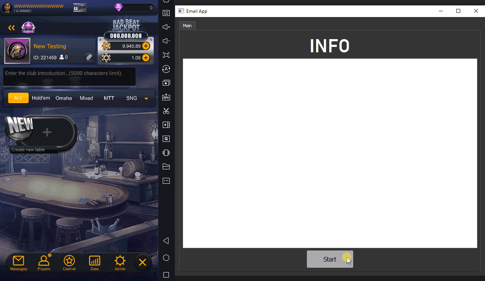
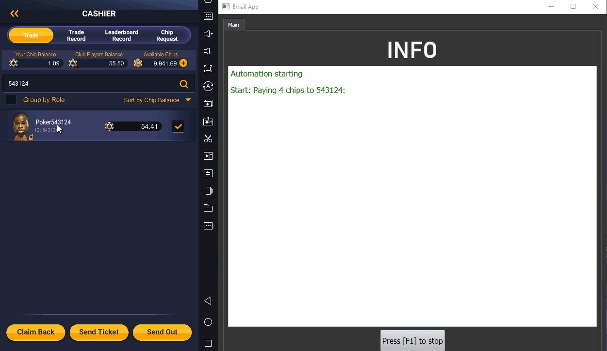
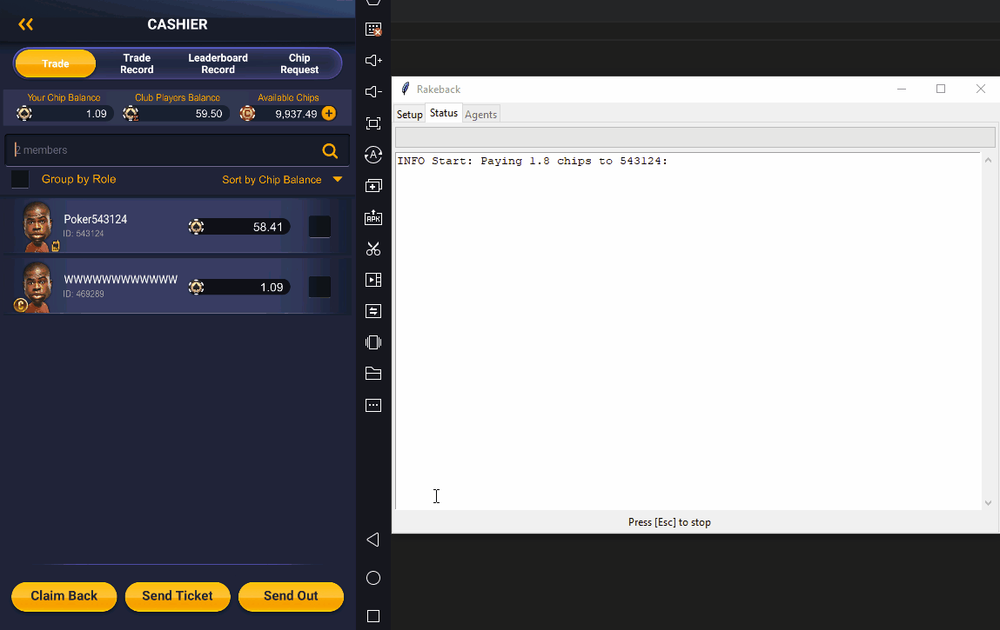
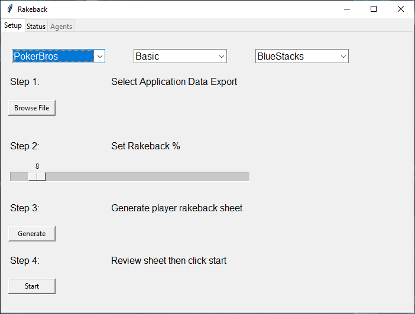

# Overview

This suite of tools is designed to automate various functions on PokerBros, including the management of rakeback payments, automatic chip deposits triggered through email, and telegram notifications. For more information on this suite of tools or to request a customized solution, please don't hesitate to contact me at gostef.com.

## Ability to automate chip deposits in response to email triggers:

## Robust Error Validation:

## Automatic Rakeback:

## Rakeback Configuration (flat rate or per-agent):

# Disclaimer

This tool is not affiliated with PokerBros in any manner. PokerBros is an online social gaming platform that exclusively provides virtual currency for gameplay and does not offer any real money services. Therefore, the app does not facilitate any direct deposit or withdrawal of real money as PokerBros does not operate a real-money cashier.